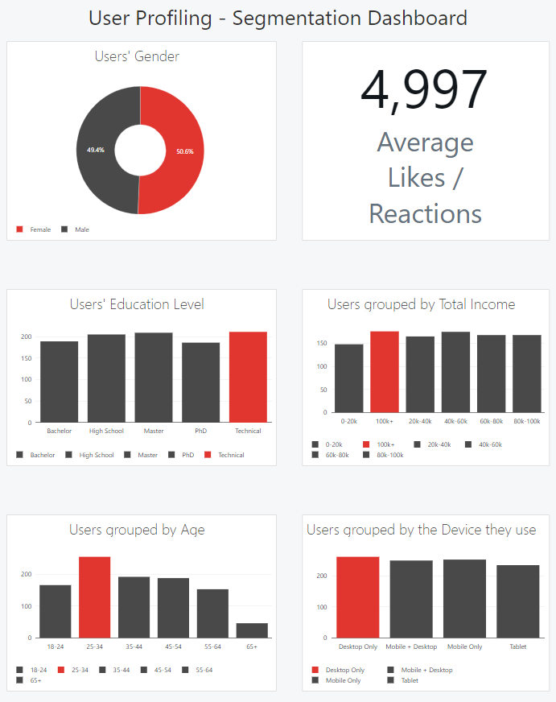
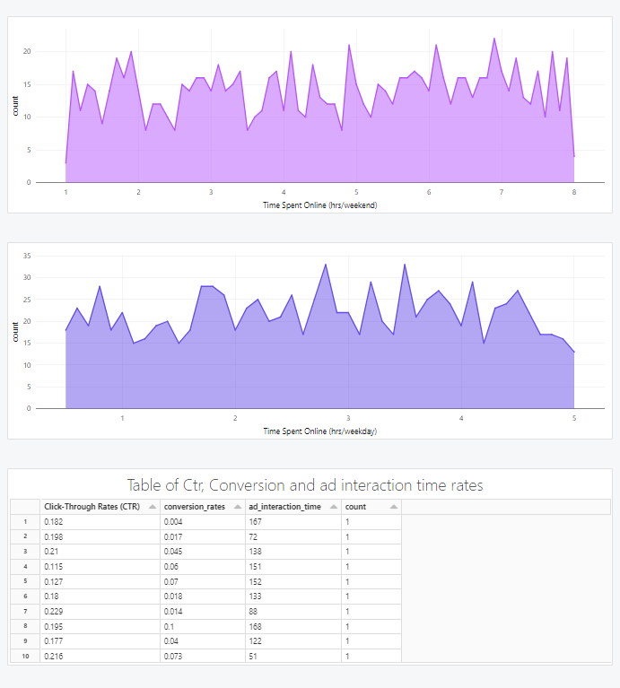

# User-Profiling-Segmentation-Analysis

A notebook using databricks and pyspark to handle a dataset of user profiles for Ads, aiming to profile and split users to segments based on several categories

[User profiling Dashboard using pyspark](https://databricks-prod-cloudfront.cloud.databricks.com/public/4027ec902e239c93eaaa8714f173bcfc/7173899576930101/1352709599770819/814834989057929/latest.html)

